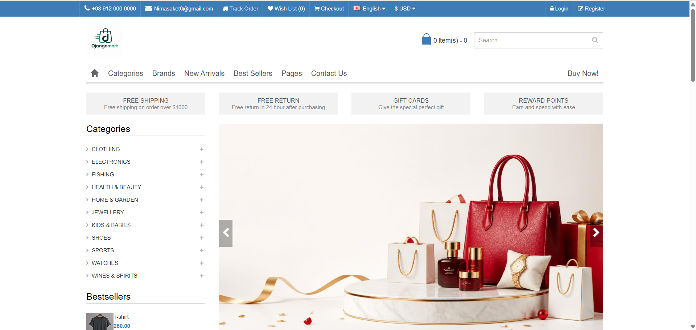
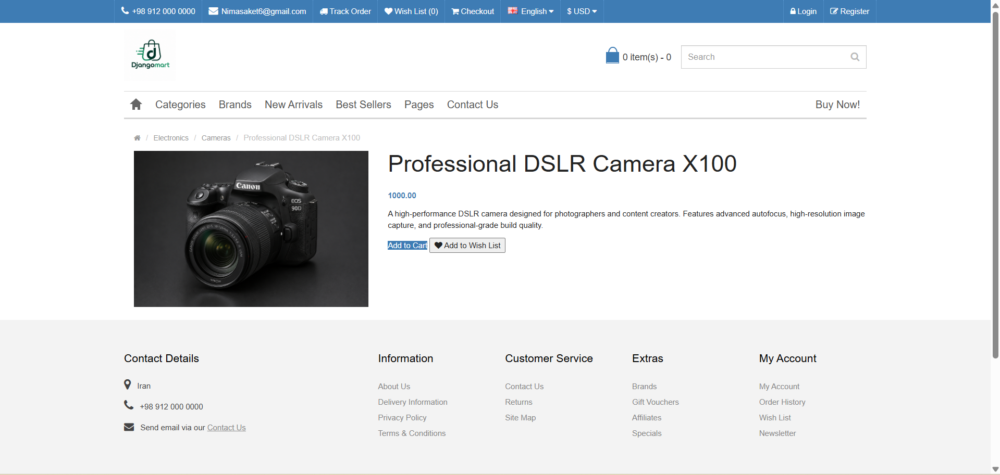

# DjangoMart 🛒

A full-featured e-commerce web application built with Django, converted from a static HTML template into a fully dynamic, database-driven shop.




## 🚀 Features

- **Dynamic Product Catalog** — Products and categories managed via Django Admin
- **Category System** — Multi-level categories using django-mptt
- **Product Detail Pages** — Individual pages for each product with images
- **Shopping Cart** — Session-based cart with add/remove functionality
- **Search** — Search products by name
- **Pagination** — Paginated product listings
- **User Authentication** — Register, Login, Logout
- **New Arrivals & Best Sellers** — Dedicated pages for featured products
- **Responsive Design** — Mobile-friendly layout

## 🛠️ Tech Stack

- **Backend:** Django 6.0
- **Database:** PostgreSQL
- **Frontend:** Bootstrap, HTML5, CSS3
- **Other:** django-mptt, Pillow, crispy-forms

## ⚙️ Installation

1. **Clone the repository**
```bash
git clone https://github.com/nima199x/django-commerce.git
cd django-commerce
```

2. **Create virtual environment**
```bash
python -m venv .venv
source .venv/bin/activate  # On Windows: .venv\Scripts\activate
```

3. **Install dependencies**
```bash
pip install -r requirements.txt
```

4. **Set up environment variables**

Create a `.env` file in the root directory:
```
DB_PASSWORD=your_postgres_password
```

5. **Run migrations**
```bash
python manage.py migrate
```

6. **Create superuser**
```bash
python manage.py createsuperuser
```

7. **Run the server**
```bash
python manage.py runserver
```

8. **Visit** `http://127.0.0.1:8000`

## 📁 Project Structure

```
django-commerce/
├── eshop_online/        # Main project settings
├── products/            # Products, categories, cart app
├── users/               # Authentication app
├── templates/           # HTML templates
│   ├── base/            # Base layout (header, footer)
│   └── includes/        # Reusable components
├── assets/              # Static files (CSS, JS, images)
└── statics/             # Media and collected static files
```

## 📸 Screenshots

| Home Page | Product Detail |
|-----------|---------------|
|  |  |

## 🔮 Roadmap

- [ ] Checkout & Order management
- [ ] Wishlist
- [ ] Product reviews & ratings
- [ ] Deployment on cloud server

## 👨‍💻 Developer

**Nima** — Learning Django by building real-world projects.

- GitHub: [@nima199x](https://github.com/nima199x)
- Email: Nimasaket6@gmail.com
